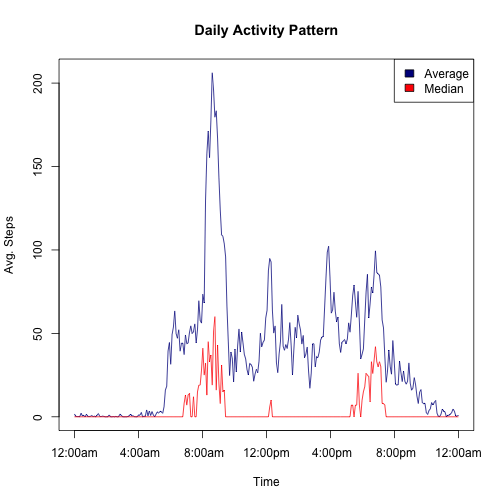

## Loading and preprocessing the data


Before beginning our analysis, we first must load the appropriate packages for our analysis. These include:

* **stringr** for manipulating strings during our pre-processing step
* **lubridate** for date parsing
* **dplyr**, which allows us to easily manipulate/transform our data frames.
* **ggplot2**, for plotting (though we'll mostly be using *base* graphics for plotting)

In addition, we'll also use this chunk to unzip the "activity.zip" file that came with this forked repository (assuming you are already in the appropriate working directory), load the resulting csv file into a data frame object, and then inspect the results.


```r
library(stringr)
library(lubridate)
library(dplyr)
library(ggplot2)

unzip("activity.zip")
activity <- read.csv('activity.csv', stringsAsFactors=FALSE)

options(scipen=3)   # To avoid calculations displayed in scientific notation
# Lastly, we inspect our results
head(activity)
```

```
##   steps       date interval
## 1    NA 2012-10-01        0
## 2    NA 2012-10-01        5
## 3    NA 2012-10-01       10
## 4    NA 2012-10-01       15
## 5    NA 2012-10-01       20
## 6    NA 2012-10-01       25
```

```r
str(activity)
```

```
## 'data.frame':	17568 obs. of  3 variables:
##  $ steps   : int  NA NA NA NA NA NA NA NA NA NA ...
##  $ date    : chr  "2012-10-01" "2012-10-01" "2012-10-01" "2012-10-01" ...
##  $ interval: int  0 5 10 15 20 25 30 35 40 45 ...
```
Next we will perform the ever-important *pre-processing* step where we'll add columns necessary for our later analysis. As you may have noticed, our "step" column contains multiple "NA"s (representing missing values), which complicates our analysis. However, for the time being we will ignore these--later in this write-up we'll devise an appropriate imputation strategy. Thus, we create two additional data frames, one which has filtered out all rows containing NAs and a second which summarizes the step data from the first. 


```r
# Process data: add POSIX date.time
interval <- str_pad(activity$interval, width=4, side='left', '0')
activity$date.time <- paste(activity$date, interval)
activity$date.time <- ymd_hm(activity$date.time)
# Add columns naming the specific day of the week & whether weekday/weekend
activity$wk.day <- wday(activity$date.time, label=TRUE)
activity$wk.part <- ifelse(activity$wk.day == 'Sat' | activity$wk.day == 'Sun',
                           'Weekend', 'Weekday')
activity$wk.part <- factor(activity$wk.part)
# Rearrange columns and add index for 5-minute intervals
activity <- activity[, c(4,2,5,6,3,1)]
activity$idx <- 1:288

# Ignoring the missing values:
idx.complete <- complete.cases(activity)
df.ignored <- activity[idx.complete, ]
daily.tot <- df.ignored %>%
             group_by(date) %>%
             summarise(totals = sum(steps, na.rm = TRUE))
```

## What is mean total number of steps taken per day?

With our aggregate data frame in hand, we can now examine the distribution of total steps per day as well as calculate various summary statistics.


```r
# Plot histogram:
hist(x=daily.tot$totals, col='lightgreen', xlab='Total Steps',
     main='Histogram of Total Steps per Day\n(Excluding Missing Values)')
```

 

```r
mean.steps <- mean(daily.tot$totals)
median.steps <- median(daily.tot$totals)
max.steps <- max(daily.tot$totals)
min.steps <- min(daily.tot$totals)

print(mean.steps)
```

```
## [1] 10766.19
```

```r
print(median.steps)
```

```
## [1] 10765
```
As we can see from the histogram, the distribution of total steps per day appears to be fairly symmetric, supported by the fact that the **mean** number of steps per day (10766.2) and the **median** (10765 steps) are very close to each other (the difference is only about 1.2 days).    

An interesting side note is that the two most active days occurred on 11/22 and 11/23--the day of and the day after **Thanksgiving**.

## What is the average daily activity pattern?

Next, we can analyze the daily activity pattern of our subject.


```r
daily <- activity %>%
         group_by(interval) %>%
         summarise(mean.steps = mean(steps, na.rm=TRUE),
                   median.steps = median(steps, na.rm=TRUE),
                   rounded.mean = round(mean(steps, na.rm=TRUE)))

# Note: xaxt='n' supresses x-axis output so label can be manually adjusted
plot(x=1:NROW(daily), y=daily$mean.steps, type='l', col='darkblue',
     xlab=NA, ylab=NA, xaxt='n')
title(ylab='Avg. Steps', xlab='Time', main='Daily Activity Pattern')
lines(x=1:NROW(daily), y=daily$median.steps, type='l', col='red')
legend(legend=c('Average', 'Median'), fill = c('darkblue', 'red'), x ='topright')

# Must create a vector of times to plot on x-axis
new.idx <- seq(from=1, to=288, length.out=7)
# Creates sequence of (properly-formatted) times and plots them on x-axis
date.idx <- seq.POSIXt(from=activity[1,1], by='hour', length.out=24)
date.idx <- pretty_dates(date.idx, n=6)
axis(side=1, at=new.idx, strftime(x=date.idx, format='%l:00%P'))
```

 

```r
max.interval <- daily$interval[which.max(daily$mean.steps)]
print(max.interval)
```

```
## [1] 835
```
In this plot we can see that clearly the most active time of day for the subject is in the morning (with the interval 835--the 5-minute interval from 8:35am to 8:40am--containing the most steps on average), most likely the result of a frantic rush to get ready for work. Additionally, I've included a plot of the *median* number of steps taken per interval, which will will be helpful when considering the appropriate imputation strategy as we will do next.


## Imputing missing values

As noted earlier in the write-up, our raw data contains many missing values (2,304 instances, to be exact). Though up until now we've been ignoring these missing values, this will no longer be the case as we now consider various **imputation** strategies.  
Although there are many possible strategies that one could emply, in the end I've used a fairly simple strategy of replacing missing values with the (rounded) mean steps per interval calculated over all days in our data set (note: the rounding process ensures that only whole numbers will be imputed--after all, what would "0.7" steps even look like?). In my own preliminary analysis I considered various imputation metrics to use such as the "median", "weighted harmonic mean", etc. However, since the distribution of steps in any given interval tends to be highly positively-skewed, the result of employing any metric which is more "robust" to outliers (which in many circumstances is the preferred approach) is a set of imputed values which, when aggregated on a per-day basis, severely underestimate daily activity levels. In other words, if you try replacing each missing value with the median value for that interval, then you'll end up *introducing* bias--not removing it--since the total number of steps per day for those imputed days will be about one tenth what they would otherwise be. But I digress...


```r
# Number of missing values (2304 total)
na.idx <- is.na(activity$steps)
num.na <- sum(na.idx)

# Create an "imputation matrix" that will work like a Python Dictionary
imp.mat <- matrix(data=daily$rounded.mean, ncol=1)
row.names(imp.mat) <- as.character(daily$interval)

# Create a new data.frame, "imputed.df" that will contain the imputed values
imputed.df <- activity
# "na.df" is a data.frame containing only those rows with an NA value
na.df <- imputed.df[na.idx, ]
# Here I pass in a character vector of indexes of NA values
na.df$steps <- imp.mat[as.character(na.df$interval), 1]
imputed.df[na.idx, ] <- na.df

daily.imputed <- imputed.df %>%
                 group_by(date) %>%
                 summarise(totals = sum(steps, na.rm = TRUE))

med.steps.imp <- median(daily.imputed$totals)
mean.steps.imp <- mean(daily.imputed$totals)

print(med.steps.imp)
```

```
## [1] 10762
```

```r
print(mean.steps.imp)
```

```
## [1] 10765.64
```

```r
# Plot a NEW histogram
hist(x=daily.imputed$totals, col='lightblue', xlab='Total Steps',
     main='Histogram of Total Steps per Day\n(with Imputed Values)')
```

 

Here we see that the (imputed) mean number of steps per day (10765.6) and (imputed) median (10762 steps) are nearly identical to our initial calculations (in fact, the slight discrepancy occurs because we use the *rounded* mean steps per interval). Although this result may at first glance seem counter-intuitive (after all, the whole point of imputation is to *remove* bias and yet our new estimates are nearly identical to those previously calculated), it makes more sense when you reconsider the structure of the missing data. Indeed, since there does not appear to be anything *systematic* about the missing values (all intervals are equally represented and both weekends and weekdays are represented as well) our resulting calculations seem reasonable. 


## Are there differences in activity patterns between weekdays and weekends?

Finally, we examine the differences in activity patterns between weekdays and weekends. As one could have guessed, the patterns are markedly different.


```r
# Note: the "wk.day" column was created in a previous chunk
g <- ggplot(data=imputed.df, aes(x=idx, y=steps, colour=wk.part)) +
     stat_summary(geom='line', fun.y='mean', na.rm=TRUE) +
     facet_grid(wk.part~.) + xlab(label='Time') + 
     ylab('Avg. Number of Steps') +
     ggtitle('Weekday vs. Weekend Walking Patterns\n') +
     scale_x_continuous(label=strftime(x=date.idx, format='%l:00%P'),
                        breaks=new.idx) +
     guides(colour=FALSE) + theme(plot.title = element_text(size=14))
g
```

 


```r
sessionInfo()
```

```
## R version 3.1.1 (2014-07-10)
## Platform: x86_64-apple-darwin13.1.0 (64-bit)
## 
## locale:
## [1] en_US.UTF-8/en_US.UTF-8/en_US.UTF-8/C/en_US.UTF-8/en_US.UTF-8
## 
## attached base packages:
## [1] stats     graphics  grDevices utils     datasets  methods   base     
## 
## other attached packages:
## [1] knitr_1.7       ggplot2_1.0.0   dplyr_0.3.0.2   lubridate_1.3.3
## [5] stringr_0.6.2  
## 
## loaded via a namespace (and not attached):
##  [1] assertthat_0.1   colorspace_1.2-4 DBI_0.3.1        digest_0.6.4    
##  [5] evaluate_0.5.5   formatR_1.0      grid_3.1.1       gtable_0.1.2    
##  [9] htmltools_0.2.6  labeling_0.3     lazyeval_0.1.9   magrittr_1.0.1  
## [13] markdown_0.7.4   MASS_7.3-35      memoise_0.2.1    mime_0.2        
## [17] munsell_0.4.2    parallel_3.1.1   plyr_1.8.1       proto_0.3-10    
## [21] Rcpp_0.11.3      reshape2_1.4     rmarkdown_0.3.3  scales_0.2.4    
## [25] tools_3.1.1      yaml_2.1.13
```

